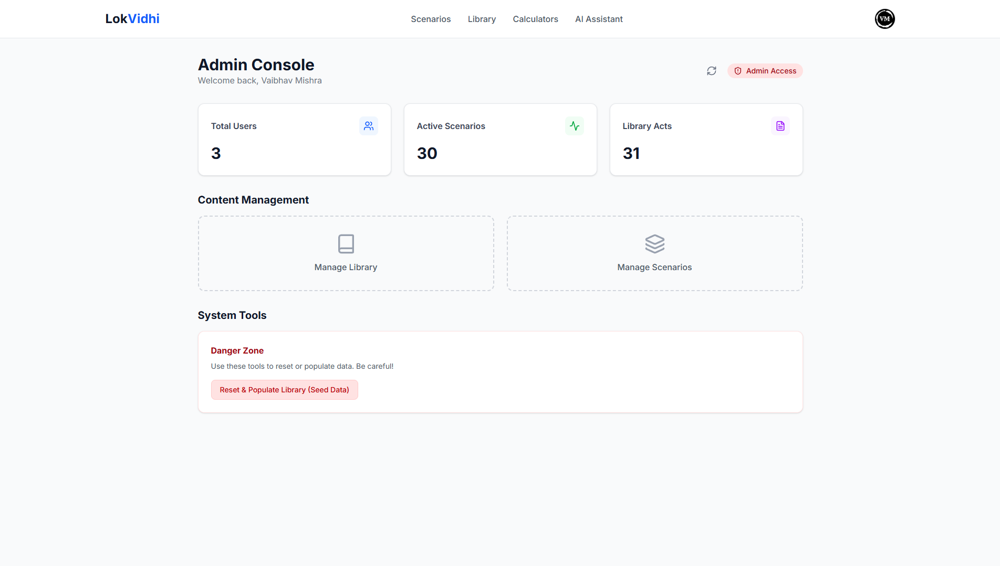

# LokVidhi - Indian Law, Simplified 🇮🇳⚖️

> **Understand your legal rights without the legalese.** LokVidhi transforms complex Indian legal codes into interactive stories, simple guides, and practical tools that everyday citizens can actually use.


---

## 📖 About

LokVidhi is a comprehensive legal literacy platform designed to make Indian law accessible to everyone. Whether you're dealing with unpaid salary, rental disputes, or just want to understand your rights if arrested, LokVidhi provides:

* **Interactive Legal Scenarios** - Learn by doing through real-life situations.
* **Smart Calculators** - Instantly compute severance pay, rent deposits, and more.
* **AI Legal Assistant** - Ask questions in plain English (or Hindi) and get answers based on actual Bare Acts.
* **Admin CMS & Moderator Panel** - Empowering moderators to manage acts, sections, and site content effectively.
* **Grounded in Reality** - Powered by Google Search integration for fact-checked, up-to-date information.

---

## 🏠 Homepage


The landing page features our core offerings:

1. **Interactive Scenarios** - Play through real-life legal situations.
2. **Legal Calculators** - Quick answers to common financial legal questions.
3. **AI Legal Bot** - Conversational legal assistant for personalized queries.

---

## 🔐 Authentication & Roles


**Features:**
* **Secure Auth:** Email/password and Google OAuth integration.
* **Role-Based Access:** Protected routes for regular users and administrative access for moderators.

---

## 🛠️ Admin CMS (New!)



The newly implemented **Admin Dashboard** allows moderators to maintain the platform's accuracy without touching the codebase:

* **Content Management:** Create and update legal acts and their respective sections.
* **Scenario Management:** Edit the interactive logic of legal walkthroughs.
* **Moderator Tools:** Manage the site and handle administrative tasks through a dedicated interface.

---

## 🎭 Interactive Scenarios


Each scenario teaches legal concepts through narrative choices, such as the **"Salary Not Paid?"** walkthrough based on the Industrial Disputes Act.

---

## 🧮 Legal Calculators


### 1. **Salary & Severance Pay Calculator**
Calculate minimum gratuity and notice pay based on labor laws.

### 2. **Rent Deposit & Notice Analyzer**
Verify if your security deposit adheres to the Model Tenancy Act principles.

---

## 🤖 AI Legal Assistant


**Powered by Google Gemini with Search Grounding**.

* **Bare Act Focus:** Answers based on IPC, CrPC, and Contract Act.
* **Real-time Verification:** Fact-checked with Google Search integration.
* **Citations:** Transparent sourcing for all legal claims.

---

## 🛠️ Tech Stack

**Frontend & Backend**
* **Next.js & TypeScript:** Powering the web interface and page routing.
* **Tailwind CSS:** For a clean, modern UI.
* **Node.js (Express):** Handling API logic and calculator services.

**Database & Infrastructure**
* **Supabase (PostgreSQL):** Managing our legal database and user sessions.
* **Vercel:** Deployment and hosting platform.
* **Redis:** Planned/implemented for caching frequent calls and enhancing UX.

---

## 🚀 Getting Started

### Prerequisites
* Node.js 18+
* Supabase Account (PostgreSQL)
* Google Gemini API key

### Installation

1. **Clone the repository**
```bash
git clone [https://github.com/yourusername/lokvidhi.git](https://github.com/yourusername/lokvidhi.git)
